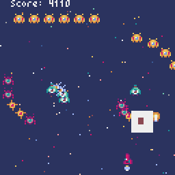

# PyxelShmup




## 概要 (Overview)
PyxelShmupは、Pythonのゲームエンジン「Pyxel」を使用して開発された2Dシューティングゲームです。レトロなピクセルアートスタイルと、シンプルながらも魅力的なゲームプレイを特徴としています。

PyxelShmup is a 2D shooting game developed using the Python game engine "Pyxel". It features retro pixel art style and simple yet engaging gameplay.

---

## 主な機能 (Main Features)
- 4つの異なるステージ構成
- 5種類の敵キャラクター
- パーティクルエフェクトによる爆発演出
- カメラシェイク効果
- スコアシステム
- ヒットストップ演出

- 4 different stage layouts
- 5 types of enemy characters
- Explosion effects with particle systems
- Camera shake effects
- Score system
- Hit-stop effects

## 操作方法 (Controls)
- 矢印キー: 移動 (Arrow keys: Movement)
- スペースキー: 発射 (Space key: Shoot)
- ESCキー: 終了 (ESC key: Exit)

## 技術仕様 (Technical Specifications)
- 開発言語: Python
- ゲームエンジン: Pyxel
- ウィンドウサイズ: 128x128ピクセル
- フレームレート: 60FPS

## 開発環境のセットアップ (Development Setup)
1. Python 3.7以上をインストール
2. Pyxelをインストール:
```bash
pip install pyxel
```
3. リポジトリをクローン
4. ゲームを実行:
```bash
python main.py
```

## バージョン情報 (Version Information)
- 現在のバージョン: 0.1.3
- 最終更新: 2025年

## ライセンス (License)
このプロジェクトはMITライセンスの下で公開されています。

This project is released under the MIT License.
